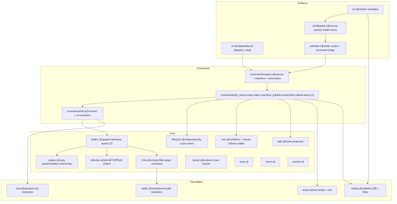
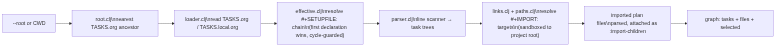
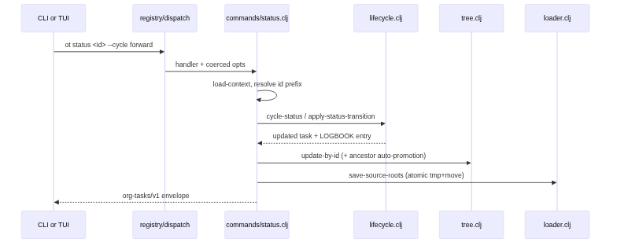

#+TITLE: ot — architecture overview
#+OPTIONS: toc:2

Human-developer-facing architectural overview of the =ot= org-tasks protocol engine. Usage lives in [[file:../../references/ot-cli.md][ot-cli.md]], machine-output schemas in [[file:contract.md][contract.md]], the ot-vs-pi ownership split in [[file:boundary.md][boundary.md]], and agent development invariants in [[file:../AGENTS.md][AGENTS.md]]. This file owns the namespace map, data flow, and design rationale — nothing here restates those contracts.

* Layering

Four layers, dependency arrows pointing down only. The command registry is the single seam between user surfaces and behaviour: CLI dispatch, =ot --help=, per-command help, option coercion, and TUI command exposure are all derived from it, so they cannot drift from each other.

#+begin_src mermaid :file design-layers.png
flowchart TD
    subgraph Surfaces
        CLI["cli.clj\nbabashka.cli dispatch + help"]
        TUI["tui.clj\ncharm view/glue"]
        TUID["tui/dispatch.clj\nnexus actions (charm-free)"]
        TUIT["tui/tasks.clj\nstate model + command bridge"]
    end
    subgraph Commands
        REG["commands/registry.clj\nspecs + handlers + summaries"]
        FAM["commands/{list_show,create,status,\narchive_publish,record,links,maintenance}.clj"]
        UTIL["commands/util.clj\ncontext + id resolution"]
    end
    subgraph Core
        LOADER["loader.clj\ngraph load/save, atomic IO"]
        PARSER["parser.clj\norg parse/serialize (round-trip)"]
        EFF["effective.clj\n#+SETUPFILE: chains"]
        LINKS["links.clj\nimport/link target resolution"]
        TREE["tree.clj\nchildren + import-children walks"]
        LIFE["lifecycle.clj\nstatus/priority cycle orders"]
        TASK["task.clj\nwire projection"]
        DOCTOR["doctor.clj\nordered pure checks"]
        SCAN["scan.clj"]
        INSERT["insert.clj"]
        SECTION["section.clj"]
    end
    subgraph Foundation
        PATHS["paths.clj\nsandboxed path resolution"]
        ROOT["root.clj\nproject-root resolution"]
        OUT["output.clj\nenvelope + exit"]
        STYLE["styling.clj\npalette-256 + bling"]
    end
    CLI --> REG
    TUI --> TUID --> TUIT --> REG
    REG --> FAM --> UTIL --> LOADER
    FAM --> LIFE
    FAM --> TREE
    FAM --> TASK
    LOADER --> PARSER
    LOADER --> EFF
    LOADER --> LINKS --> PATHS
    FAM --> OUT
    FAM --> STYLE
    TUI --> STYLE
    UTIL --> ROOT
#+end_src

#+RESULTS:

Notable boundaries:

- =styling.clj= (bling, one-shot CLI text) and the TUI (charm, interactive screen) are intentionally separate rendering stacks, but share one colour definition: =styling/palette-256= is canonical, bling keyword codes are pinned by test, and the TUI builds charm =ansi256= colours from the same map.
- =tui/dispatch.clj= is charm-free by design: nexus actions over plain state maps, individually testable without a terminal.
- The TUI reuses command handlers in-process through =tui/tasks.clj='s data-level bridge (=output/emit-result= returns the envelope map; =*exit-fn*= carries errors), rather than shelling out or re-parsing printed JSON.

* Graph load pipeline

Every command starts from the same load path.

#+begin_src mermaid :file design-load.png
flowchart LR
    A["--root or CWD"] --> B["root.clj\nnearest TASKS.org ancestor"]
    B --> C["loader.clj\nread TASKS.org / TASKS.local.org"]
    C --> D["effective.clj\nresolve #+SETUPFILE: chain\n(first declaration wins, cycle-guarded)"]
    D --> E["parser.clj\nline scanner → task trees"]
    E --> F["links.clj + paths.clj\nresolve #+IMPORT: targets\n(sandboxed to project root)"]
    F --> G["imported plan files\nparsed, attached as :import-children"]
    G --> H["graph: tasks + files + selected"]
#+end_src

#+RESULTS:

Key properties:

- The parser is a stateful line scanner with round-trip guarantees: unknown keywords, drawers, and body content are preserved byte-identically (fixtures under =test/fixtures/round-trip/=). An unterminated =:PROPERTIES:=/=:LOGBOOK:= drawer (no =:END:= before EOF) is a hard parse error (=unterminated-drawer=, naming file + line) rather than silently swallowing the rest of the file.
- Each UUID has one canonical writable node: mutations on imported plan tasks persist to the task's own source file via =loader/save-source-roots=, never to a copy. =archive=/=publish=/=unpublish= re-stamp a task's =:source-path= and hand the whole graph to =save-source-roots=, so it works uniformly whether the task's original root lived in =TASKS.org=, =TASKS.local.org=, or a file-level =#+IMPORT:= plan file — it is never left behind in one file while appearing in another.
- =save-source-roots= is an optimistic-concurrency writer: before rewriting a file it compares the current on-disk bytes against the load-time snapshot (=:source-content=, or the caller-supplied baseline for files that may end up with zero roots) and aborts with a =conflict= error, file untouched, on a mismatch. Every file write goes through =loader/atomic-write= (unique per-call tmp name, then rename).
- =loader/safe-slurp= only returns =nil= for a genuinely missing file; a read failure on an existing file (e.g. a broken =TASKS.archive.org=) throws =unreadable= instead of being treated as empty.
- All import/link resolution flows through =org-tasks.links= into =paths.clj= sandboxing (realpath, traversal rejection) — one audit point for path escapes. The TUI's plan-open action reuses this same resolution (via =ot show='s record-path lookup) instead of opening a raw =plan:foo.org= link token as a literal path.

* Mutation flow (example: =ot status=)

#+begin_src mermaid :file design-mutation.png
sequenceDiagram
    participant U as CLI or TUI
    participant R as registry/dispatch
    participant H as commands/status.clj
    participant L as lifecycle.clj
    participant T as tree.clj
    participant IO as loader.clj
    U->>R: ot status <id> --cycle forward
    R->>H: handler + coerced opts
    H->>H: load-context, resolve id prefix
    H->>L: cycle-status / apply-status-transition
    L-->>H: updated task + LOGBOOK entry
    H->>T: update-by-id (+ ancestor auto-promotion)
    H->>IO: save-source-roots (atomic tmp+move)
    H-->>U: org-tasks/v1 envelope
#+end_src

#+RESULTS:

The same shape applies to =priority=, =select=, =archive=, =publish=, and the property commands (=handoff= / =blocker= / =issue=, generated from a per-property data map in =commands/links.clj=). Cycle orders (status, priority incl. the unset slot) live in =lifecycle.clj=; both UIs pass only a direction.

* TUI design

- charm.clj owns the terminal program loop (raw mode, key decode, resize, cleanup); stdout is reserved for one final selected-task envelope on exit.
- State is a plain map; charm messages become nexus actions (=tui/dispatch.clj=), which expand to effects against the state and, for mutations, in-process command calls through the bridge.
- Layout: side-by-side tree/details on landscape terminals; stacked (details below tree, viewport split by =tasks/tree-pane-height=) when narrow (width < 80) or portrait (width < height × 2, correcting for the ~1:2 terminal cell aspect). =tasks/stacked-layout?= owns the rule so rendering and cursor-scroll math agree.
- Row rendering colours status and priority tokens from the shared palettes, matching =ot list= exactly.

* Project layout

#+begin_example
deps.edn / bb.edn               # repo-root tools.deps + bb tasks (bb.edn is dep source of truth)
skills/org-tasks/scripts/
  ot                            # in-tree shell shim (fallback -Sdeps mirrors bb.edn)
  README.md                     # install, testing, documentation map
  AGENTS.md                     # invariants for agents developing ot
  src/org_tasks/
    cli.clj                     # entry point; dispatch/help derived from registry
    commands/                   # registry.clj + command family namespaces + util.clj
    tui.clj  tui/               # charm view/glue; tasks.clj bridge; dispatch.clj actions
    parser.clj                  # org parse/serialize (round-trip preserving)
    loader.clj effective.clj    # graph IO; setupfile chains
    links.clj paths.clj root.clj# link/import resolution; sandbox; project root
    tree.clj task.clj           # traversal; wire projection
    lifecycle.clj               # status/priority transition + cycle orders
    doctor.clj scan.clj         # health checks; summary scans
    insert.clj section.clj      # task insertion; section reads
    output.clj styling.clj      # envelope/exit; palette-256 + bling helpers
    editor.clj                  # $EDITOR/emacsclient resolution for TUI edit keys
  test/org_tasks/               # unit + integration tests (commands/ mirrors src)
  test/fixtures/round-trip/     # byte-identical org fixtures
  docs/                         # DESIGN.org, contract.md, boundary.md, test-map.md
#+end_example

* Design history

Architectural decisions are recorded as change-records under =design/log/=; the most relevant: the TypeScript→Babashka cutover (=2026-05-18-tasks-extension-ot-cli.org=), the TUI addition (=2026-06-27-add-org-tasks-tui.org=), the TUI namespace split and data-level command API (=2026-07-02-simplify-ot-internals-tui-namespace-spli.org=), and the deduplication pass that produced =links.clj= / =tree.clj= and the derived registry artefacts (=2026-07-03-ot-deduplication-and-simplification-pass.org=).
